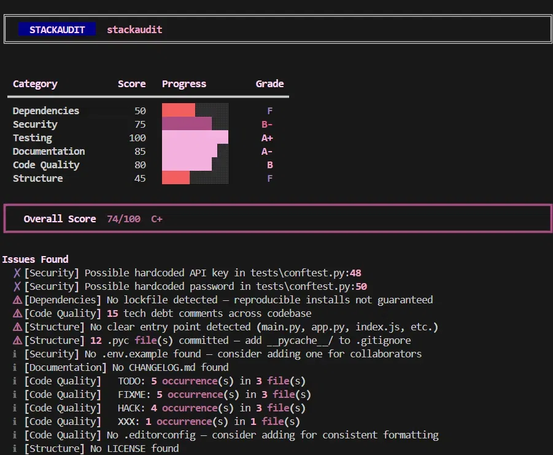
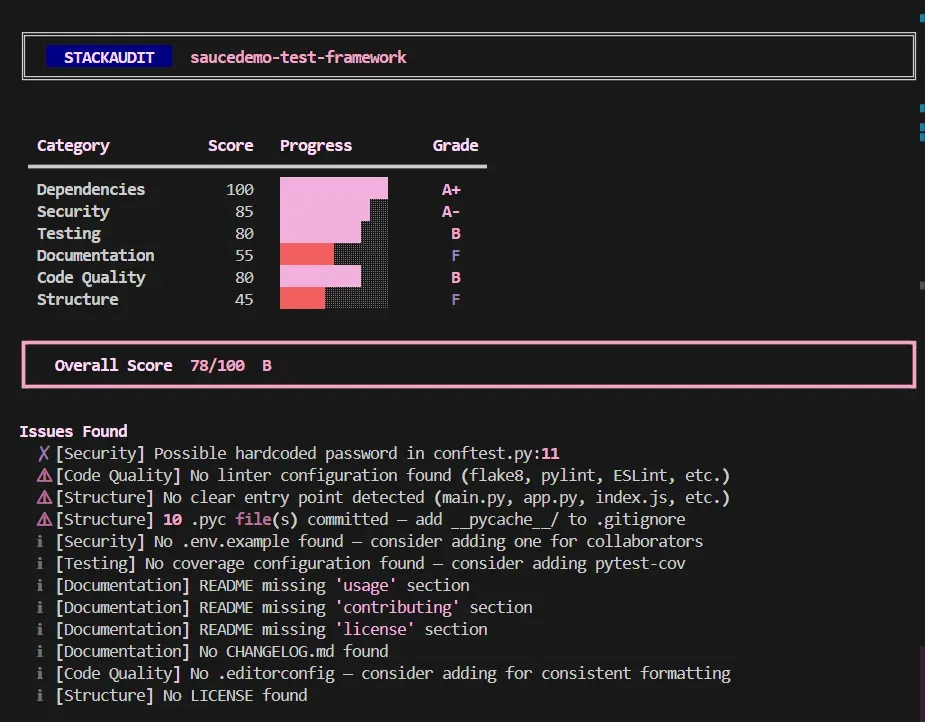
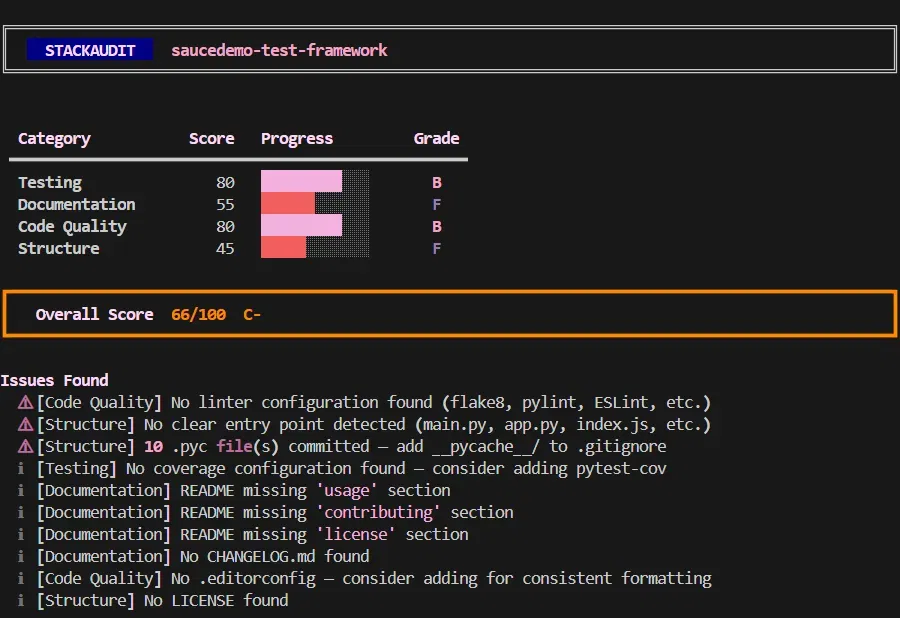
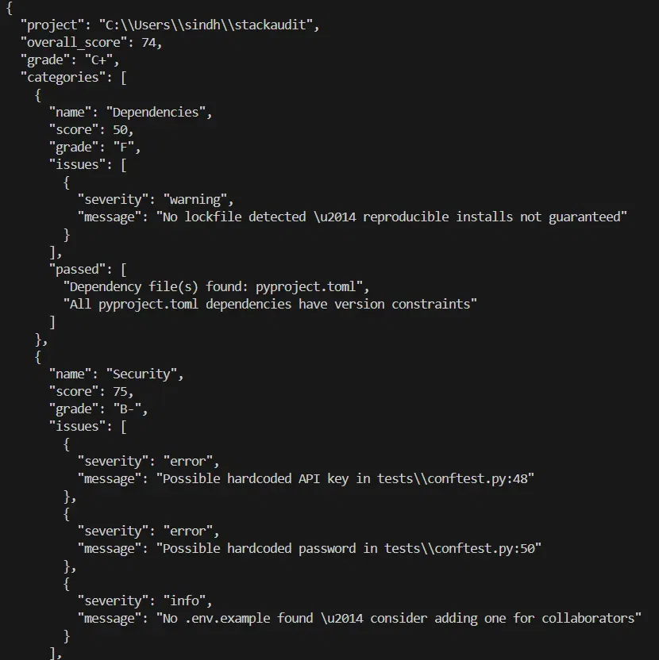
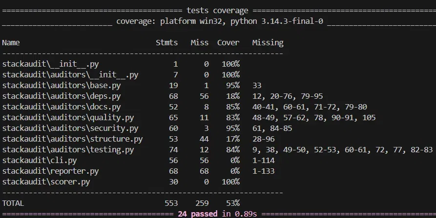

<div align="center">

# stackaudit

**
A CLI tool that audits any project directory and generates a scored, graded health report card across six categories: dependencies, security, testing, documentation, code quality, and structure.
**


</div>

---

## What is stackaudit?

Point it at any project folder and get a graded report card across six categories — dependencies, security, testing, documentation, code quality, and structure. Each category is weighted and scored out of 100, with a final letter grade.



---

## Installation

```bash
git clone https://github.com/sindhuja8812/stackaudit
cd stackaudit
pip install -e .
```

---

## Usage

```bash
# audit any project
stackaudit /path/to/project

# audit current directory
stackaudit .

# skip specific auditors
stackaudit . --skip security,deps

# get machine-readable JSON output
stackaudit . --output json
```

---

## How scoring works

| Category | Weight | What it checks |
|---|---|---|
| Security | 25% | Hardcoded secrets, `.env` in git, `.gitignore` |
| Dependencies | 20% | Lockfile, outdated packages via PyPI |
| Testing | 20% | Test directory, pytest config, coverage, CI |
| Documentation | 15% | README quality, sections, word count, badges |
| Code Quality | 10% | TODO/FIXME count, linter config, large files |
| Structure | 10% | Entry point, LICENSE, package layout |

Grades follow standard A+/A/B/C/D/F scale. Overall score is a weighted average.

---

## Examples

### Running on a test framework project



### Skipping auditors with `--skip`



### JSON output for scripting and CI



---

## Exit codes

| Code | When |
|---|---|
| `0` | Score ≥ 80 |
| `1` | Score 60–79 |
| `2` | Score < 60 |

Use exit codes to fail CI builds when project health drops below a threshold.

```yaml
# example GitHub Actions step
- name: Audit project health
  run: stackaudit . && echo "Health check passed"
```

---

## Test suite

24 tests across all 6 auditors, passing on Python 3.9, 3.10, 3.11, and 3.12.



---

## Project structure

```
stackaudit/
├── stackaudit/
│   ├── cli.py              # typer CLI entry point
│   ├── scorer.py           # weighted grade calculator
│   ├── reporter.py         # rich terminal output
│   └── auditors/
│       ├── deps.py         # dependency checks
│       ├── security.py     # secret scanning
│       ├── testing.py      # test coverage checks
│       ├── docs.py         # README quality
│       ├── quality.py      # tech debt scanner
│       └── structure.py    # project layout
└── tests/                  # 24 tests
```

---

## Adding a custom auditor

1. Create `stackaudit/auditors/mycheck.py` extending `BaseAuditor`
2. Register it in `auditors/__init__.py` and `cli.py`
3. Add tests in `tests/test_mycheck.py`

---

## Development

```bash
pip install -e ".[dev]"
pytest -v
```

---

## License

MIT — see [LICENSE](LICENSE) for details.